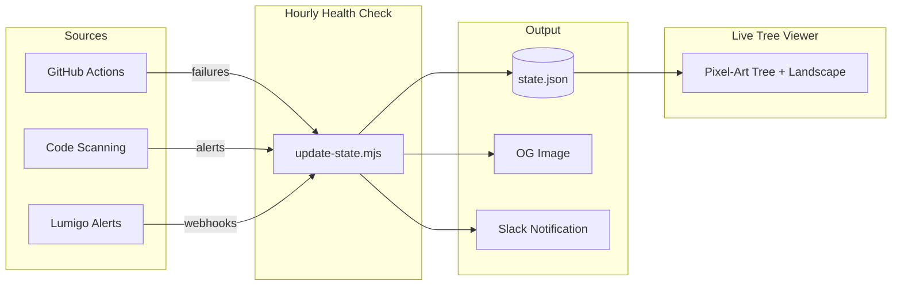

<div align="center">

# YggdraLizy

### Your SDLC health, visualized as a living Norse tree


[](https://github.com/lizy-lab/yggdralizy/actions/workflows/deploy.yml)
[](https://github.com/lizy-lab/yggdralizy/actions/workflows/update_state.yml)

</div>

## What is this?

YggdraLizy turns your software pipeline health into a **pixel-art Yggdrasil tree** that grows when your CI is green and withers when things break. It monitors GitHub Actions failures, code scanning alerts, and Lumigo observability events -- translating them into a single living metaphor your whole team can glance at.

> Keep the tree alive. Keep the pipeline healthy.

## How it works



Every hour, a GitHub Actions workflow polls your repo for incidents. Each incident damages the tree's HP. Over time without incidents, the tree heals and grows through **8 mythological stages**:

```mermaid
graph LR
    S0["Seed of Origin"]
    S1["Awakening Seed"]
    S2["Sprout of Realms"]
    S3["Roots of Wisdom"]
    S4["Trunk of Strength"]
    S5["Branches of Fate"]
    S6["Guardian of Worlds"]
    S7["Yggdrasil Ascendant"]

    S0 -->|1h| S1 -->|3h| S2 -->|8h| S3 -->|18h| S4 -->|36h| S5 -->|72h| S6 -->|144h| S7

    style S0 fill:#8B6914,color:#fff
    style S1 fill:#6B8E23
    style S2 fill:#228B22
    style S3 fill:#2E8B57
    style S4 fill:#006400
    style S5 fill:#004d00
    style S6 fill:#003300
    style S7 fill:#FFD700,color:#000
```



## Damage & Healing

| Event | HP Impact |
|-------|-----------|
| CI pipeline failure | **-10 HP** |
| Code scanning alert | **-5 HP** |
| Lumigo alert (critical) | **-15 HP** |
| Lumigo alert (warning) | **-10 HP** |
| Lumigo alert (info) | **-5 HP** |
| Passive regeneration | **+10 HP/hour** |
| Reaching 0 HP | Ragnarok (death + reset to seed) |

## Visual Features

- **Day/Night cycle** -- the landscape shifts between sun-lit meadows and moonlit starfields based on real time
- **Dynamic weather** -- rain and embers appear when the tree takes damage
- **Ragnarok mode** -- the sky turns red, the tree catches fire when HP reaches zero
- **Interactive elements** -- clickable sun/moon, Ratatoskr the squirrel mascot, ambient birds and fireflies
- **4 health palettes** -- the tree's colors shift from lush green to withered brown to skeletal gray as HP drops

## Tech Stack

| Layer | Technology |
|-------|-----------|
| Frontend | React 19, TypeScript, Vite |
| Styling | Tailwind CSS, custom SVG pixel art |
| Monitoring | GitHub Actions API, Lumigo webhooks |
| Notifications | Slack (via webhook) |
| OG Images | @resvg/resvg-js (server-side PNG) |
| Hosting | GitHub Pages |

## Getting Started

**Prerequisites:** Node.js 18+

```bash
# Clone the repo
git clone https://github.com/lizy-lab/yggdralizy.git
cd yggdralizy

# Install dependencies
npm install

# Set your API key
cp .env.local.example .env.local
# Edit .env.local with your GEMINI_API_KEY

# Run locally (demo mode -- time runs in seconds)
npm run dev
```

In demo mode, the tree grows and heals in seconds instead of hours so you can see the full lifecycle quickly.

## Project Structure

```
yggralizy/
├── index.tsx                  # Main React app (tree, landscape, UI)
├── index.html                 # Entry point
├── scripts/
│   ├── update-state.mjs       # Hourly health monitor
│   ├── generate-og-image.mjs  # Dynamic OG image generator
│   └── send-slack.mjs         # Slack notifier
├── public/
│   ├── data/state.json        # Persisted tree state (HP, stage, events)
│   └── og-snapshots/          # Historical OG image captures
└── .github/workflows/
    ├── update_state.yml       # Hourly cron: poll health sources
    └── deploy.yml             # Deploy to GitHub Pages on push
```

## License

MIT
